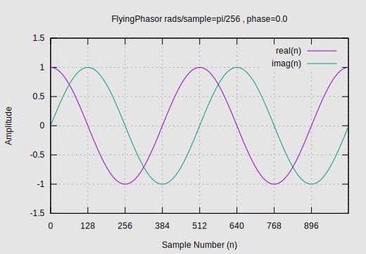
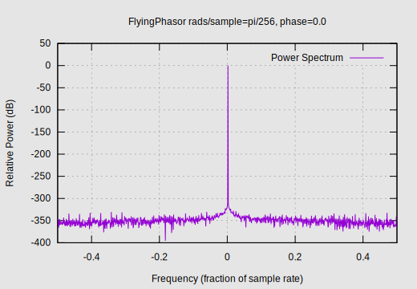
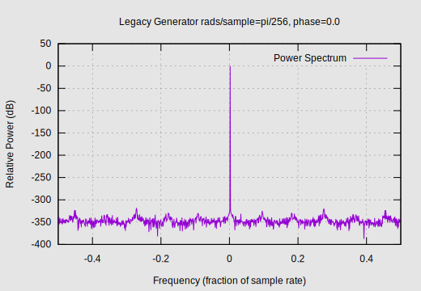

# ReiserRT_FlyingPhasor

Frank Reiser's C++11 implementation of a fast and accurate, sin/cos waveform pair (I/Q) generator.

## Overview
This tone generator evolved out of a desire to generate complex exponential waveforms (sinusoids) fast and accurate.
The traditional way of doing this, involved repeated calls to sin and cos functions with an advancing,
radian input argument. This produces accurate results, at least over a limited domain interval.
However, it is computationally intensive, not very fast, and subject to domain range issues.

If a continual sequence of complex values are what is required for an application.
The task of generating this sequence can be accomplished by simply rotating a phasor around the unit circle.
The only trigonometric functions required, are invoked during initialization.
After initialization, we require no more than a handful of arithmetic operations (maybe a couple handfuls).
This feat is accomplished with a sprinkle of "state data" and a little "loving care".
It is immune from domain range limits since it does not track, or care about, "cycles".
Note that this is not necessarily true for implementations of std::sin and std::cos as large radian
input values may result in instability. 

## Details
A little more should be said regarding the "loving care" mentioned above.
This tone generator is taking advantage of Euler's mathematics of the unit circle.
When you multiply two phasors, you multiply the magnitudes and add the angles.
When applied to unit vectors (magnitudes of one), the resultant magnitude stays one,
you simply add the angles. Our state data unit vectors are in rectangular form,
we simply preform a complex multiply in rectangular form, the resultant magnitude
of which may drift away from one. Because of this, a re-normalization cycle must be
preformed on some periodic basis. This tone generator performs
this re-normalization every other sample. This was chosen for two reasons.
1) It puts any resultant re-normalization spur at the Nyquist rate (edge of bandwidth).
2) Re-normalizing at every other sample, keeps its noise contribution minimal.
Additionally, with such small errors at every other cycle,
a simple and inexpensive linear approximation is all that is required to maintain stability.

Regarding the "state data", this tone generator was designed to generate a single tone per instance.
An instance is constructed with an initial frequency and phase.
When an initial number of samples are requested from an instance, they are delivered
from the starting phase angle at a fixed radians per sample, rate. Subsequent sample requests,
are delivered in phase (continuous) with the previous samples delivered. An instance
may be "reset" however, to produce a different phased tone. Resetting re-initializes all "state data"
as if the object were just constructed. The amount of state data maintained is fairly small.
If numerous tones are simultaneously required, instantiate multiple tone generators and add the
results.

# Example Data Characteristics
Here, we present some example data created with the 'streamFlyingPhasorGen' utility program included
with the project. We generated 1024 samples at pi/256 radians per sample with an initial phase of zero.
This data is plotted below:

Figure 1 - Example Flying Phasor Sample Series Data



From the figure, we see what looks like a cosine wave and a sine wave. It looks pretty good but, looks
can be deceiving. What does the spectrum look like? Are there any notable spurs in the frequency domain?
We will take a look at the power spectrum, plotted in decibels for an extended dynamic range view. We
did not apply any window to the sample series data here as our signal is right on a basis function.
Applying a window in this case would distract from our analysis.
This data is plotted below:

Figure 2 - Example Flying Phasor Power Spectrum Data



As can be seen, we have in excess of 300 dB of spur free dynamic range. This seems phenomenal but, how
does this compare to the legacy method? In order to compare, we use utility 'streamFlyingPhasorGen'
program included with the project, using the same parameters.
This data is plotted below:

Figure 3 - Example Legacy Generator Power Spectrum Data



As can be seen, the legacy method has in excess of 300 dB of spur free dynamic range as would be
expected. It also has a slightly tighter skirt than the FlyingPhasor but, this detail is noted
just above our noise floor. The FlyingPhasor generator noise floor actually looks better than
the legacy method. Benchmarking indicates that the FlyingPhasor tone generator is 
approximately a factor of 5 times faster than the legacy method and is comparable in spur free dynamic range.
You be the judge.

# Interface Compatibility
This component has been tested to be interface-able with C++20 compiles. Note that the compiled library code
is built using the c++11 standard. API/ABI stability will be maintained between minor versions of this project. 

# Thread Safety
This tone generator is not "thread safe". There are no concurrent access mechanisms
in place and there is no good reason for addressing this. To the contrary,
state left by one thread would make little sense to another, never mind the concurrency issues.
Have threads use their own unique instances.

# Acknowledgements
I cannot take credit for this algorithm. It is really just high school math.
This implementation was derived from something I saw on Stack Exchange.
What I have done is to actually utilize std::complex instead of a discrete reimplementation
of complex math, fine honed the re-normalization period, and turned it into a reusable object that
meets my needs. Also, I provide some test harnesses that prove its worthiness. 

## Building and Installation
Roughly as follows:
1) Obtain a copy of the project
2) Create a build folder within the project root folder.
3) Switch directory to the build folder and run the following
   to configure and build the project for your platform:
   ```
   cmake ..
   cmake --build .
   ```
4) Test the library
   ```
   ctest
   ```
5) Install the library as follows (You'll most likely
   need root permissions to do this):
   ```
   sudo cmake --install .
   ```
